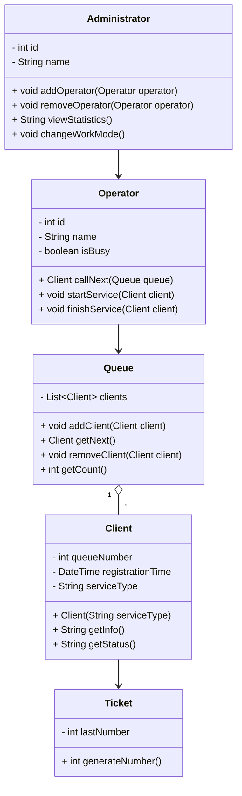

```mermaid
classDiagram

class Client {
    - int queueNumber
    - DateTime registrationTime
    - String serviceType
    + Client(String serviceType)
    + String getInfo()
    + String getStatus()
}

class Operator {
    - int id
    - String name
    - boolean isBusy
    + Client callNext(Queue queue)
    + void startService(Client client)
    + void finishService(Client client)
}

class Queue {
    - List~Client~ clients
    + void addClient(Client client)
    + Client getNext()
    + void removeClient(Client client)
    + int getCount()
}

class Ticket {
    - int lastNumber
    + int generateNumber()
}

class Administrator {
    - int id
    - String name
    + void addOperator(Operator operator)
    + void removeOperator(Operator operator)
    + String viewStatistics()
    + void changeWorkMode()
}

Queue "1" o-- "*" Client
Operator --> Queue
Client --> Ticket
Administrator --> Operator
```
