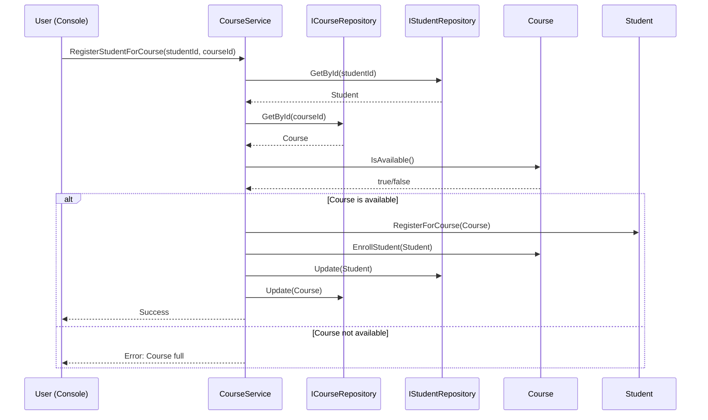

# Sequence Diagram - Course Registration

```mermaid
sequenceDiagram
    participant U as User (Console)
    participant CS as CourseService
    participant CR as ICourseRepository
    participant SR as IStudentRepository

    U->>CS: RegisterStudentForCourse(studentId, courseId)
    CS->>SR: GetById(studentId)
    SR-->>CS: Student
    CS->>CR: GetById(courseId)
    CR-->>CS: Course
    CS->>Course: IsAvailable()
    Course-->>CS: true/false
    alt Course is available
        CS->>Student: RegisterForCourse(Course)
        CS->>Course: EnrollStudent(Student)
        CS->>SR: Update(Student)
        CS->>CR: Update(Course)
        CS-->>U: Success
    else Course not available
        CS-->>U: Error: Course full
    end
```